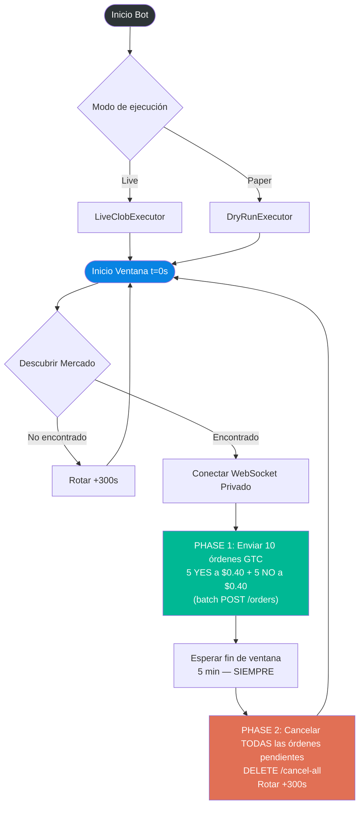
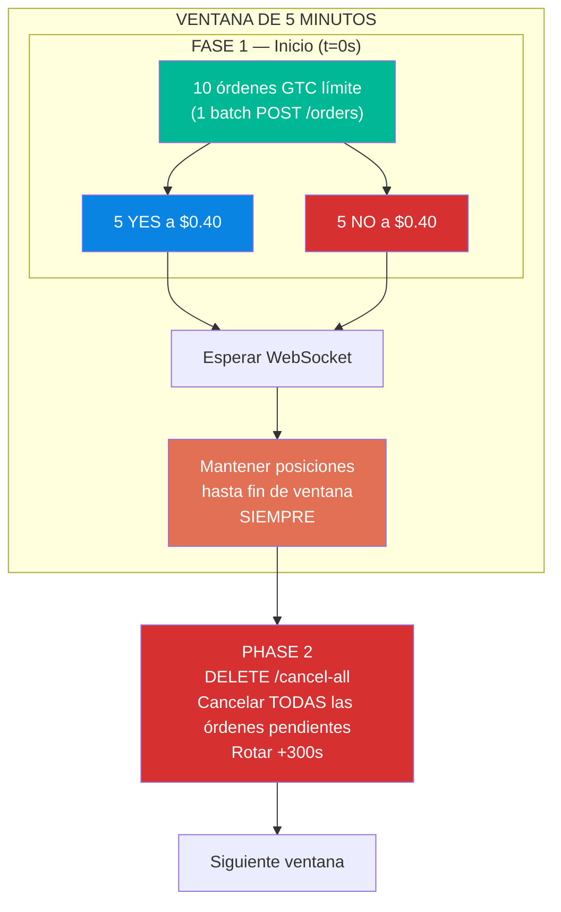
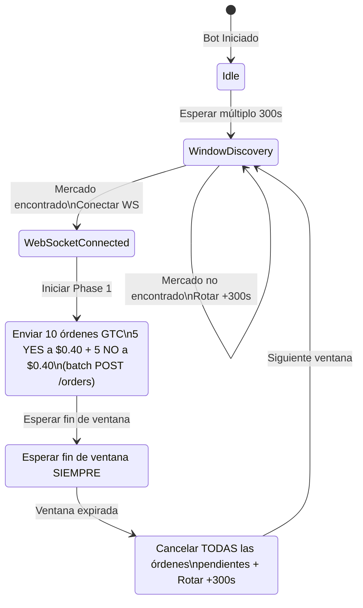

## 0 Objetivo Principal

> [!warning] **HISTÓRICO** 
>  Plan original. Fuente actualizada en `openspec/`. Cambios verificados contra docs oficiales: SDK `py-sdk` | Colateral **pUSD** | Cancel-all `DELETE /cancel-all` | Mínimo **5 shares** | TWAP **60s** | Rate limits 2 capas | WS eventos `type`/`status` mayúsculos | WS reconnection sync | TWAP feed | partial rejection handling

## 0 Objetivo Principal

Desarrollar un bot de trading automatizado para el mercado **BTC 5-min UP/DOWN** de [Polymarket](https://polymarket.com) que implemente una estrategia de **hedge acumulativo** (compra en ambos lados) para explotar las fluctuaciones de precios durante la ventana de 5 minutos.

### Mercado objetivo
- **Plataforma**: [Polymarket](https://polymarket.com)
- **Mercado**: Bitcoin Up or Down — 5 minute windows
- **API**: [CLOB API v2](https://docs.polymarket.com/#clob-api)
- **Slug (Gamma API)**: `btc-updown-5m-{timestamp}` (verificar formato exacto en Gamma API; ventanas alineadas a múltiplos de 300s)
- **Orden mínima por orden GTC/GTD**: **5 shares** (verificado manualmente con mercados BTC up/down reales). Gamma API retorna `trading.minimumOrderSize: "5"` (string).
- **Documentación oficial**: [docs.polymarket.com](https://docs.polymarket.com)
---
## 1 Comportamiento teorico del bot

### Comportamiento teorico
**Phase 1**: 
1. Cuando comience la ventana de mercado el bot enviará en una sola petición 10 órdenes límites GTC (5 - YES a $0.40 y 5 - NO a $0.40)
2. Se esperan los reportes de ejecución vía WebSocket de las 10 órdenes.
3. El bot **espera SIEMPRE** hasta el final de la ventana de 5 minutos, independientemente de cuántas órdenes se hayan ejecutado.

**Phase 2** (siempre al final de la ventana):
4. El bot cancelará **TODAS** las órdenes pendientes/no ejecutadas via `DELETE /cancel-all`.
5. Una vez canceladas, el bot inicia la rotación: avanza +300s y comienza una nueva ventana de mercado.

> [!warning] Flujo estricto
> Phase 2 (cancelación + rotación) se ejecuta **SIEMPRE** al final de la ventana. No existe ruta corta. El bot nunca cancela anticipadamente por no recibir todos los fills.

### Reglas fundamentales

> [!warning] Flujo de fases
> El bot pasa de Phase 1 a Phase 2 **siempre** al final de la ventana (300s). La única condición para cambiar de fase es que la ventana haya expirado. Esto es de estricto cumplimiento.

> [!important] Cantidad, no monto
> El bot comprará por **cantidad de acciones**, no por monto en dólares.
>
> - **Correcto**: Precio llega a $0.40 → compra **5 acciones** = $2.00
> - **Incorrecto**: Precio llega a $0.40 → compra **$2.00 en acciones**
>
> El monto máximo por ronda es $2.00 por lado ($2.00 para YES + $2.00 para NO = $4.00 total).

> [!important] Tipo de órdenes
> Todas las órdenes son **órdenes límites GTC**
> ([Good Till Cancelled](https://docs.polymarket.com/concepts/order-lifecycle))
> El precio límite de cada orden es **$0.40 exacto** (sin buffer adicional).
> Las órdenes se colocan como **maker** (no cruzan el spread).

> [!important] Batch endpoint
> El endpoint `POST /orders` de Polymarket acepta múltiples órdenes por solicitud (máximo **15 órdenes** por request según la especificación OpenAPI `maxItems: 15`).
> Las órdenes se envían en una **sola llamada batch** (10 órdenes: 5 YES + 5 NO), reduciendo latencia
> y riesgo de ejecución desincronizada.
> Documentación: [CLOB API — Place Orders](https://docs.polymarket.com/#clob-api).

> [!warning] Órdenes GTC no se cancelan automáticamente
> Una orden GTC permanece activa en el libro **hasta que se ejecute o se cancele manualmente**.
> El bot **debe** cancelar explícitamente las órdenes pendientes en Phase 2 vía `DELETE /cancel-all` (endpoint canónico V2 del CLOB).
> Si no se cancelan, quedarán huérfanas y podrían ejecutarse erróneamente en el siguiente mercado si el tokenID coincide.

> [!important] Monitoreo en tiempo real via WebSocket
> El monitoreo de órdenes se realiza via **WebSocket privado** de Polymarket.
> El WebSocket entrega actualizaciones en el momento en que ocurren (~88ms de latencia). Documentación: [CLOB API — WebSocket](https://docs.polymarket.com/#websocket-api).

> [!note] Detalles de autenticación
> El mensaje de auth incluye `markets` (opcional, filtra por mercado) y soporta `updateSubscription` para suscripción dinámica sin reconectar:
> ```json
> {"operation": "subscribe", "markets": ["<condition_id>"]}
> ```
> **El `condition_id` se extrae del objeto market que devuelve `discover()` de Gamma API.** Los tokens YES y NO del mismo mercado comparten el mismo `condition_id` — suscribirse a ese ID recibe updates de ambos. Antes de enviar órdenes en Phase 1, extraer `condition_id` y suscribir el WebSocket a ese ID.
> El SDK `py-sdk` provee método `get_balance()` que envuelve `GET /balance-allowance`.


---
### Racionalidad de la estrategia (contexto externo)
El bot implementa una estrategia de **hedge acumulativo**: compra acciones en ambos lados (YES y NO) para garantizar ganancia independientemente del resultado. 
**Esta sección documenta POR QUÉ la estrategia es rentable — el bot NO calcula nada de esto internamente:**

**Fórmula de ganancia por mercado:**
```
Ganancia = (Acciones_ganadoras × $1.00) - Costo_total

Donde:
  Acciones_ganadoras = cantidad de acciones del lado que gana
  Costo_total = (Acciones_YES × Precio_YES) + (Acciones_NO × Precio_NO)
```

**Ejemplo concreto:**

| Lado      | Acciones | Precio compra | Costo     |
| --------- | -------- | ------------- | --------- |
| YES       | 5        | $0.40         | $2.00     |
| NO        | 5        | $0.40         | $2.00     |
| **Total** | **10**   | —             | **$4.00** |

**Si gana YES:**
```
Ganancia = (5 × $1.00) - $4.00 = $5.00 - $4.00 = $1.00
```

**Si gana NO:**
```
Ganancia = (5 × $1.00) - $4.00 = $5.00 - $4.00 = +$1.00
```

> **Resultado**: Con ejecución completa de Phase 1 (5 YES + 5 NO a $0.40), la estrategia **siempre gana**: si gana YES obtiene +$1.00, si gana NO obtiene +$1.00. 

> [!note] El bot no calcula ni loguea ganancias
> Todo el cálculo anterior es la **justificación teórica** de la estrategia. El bot solo ejecuta: colocar órdenes → esperar → cancelar → rotar.

## 2 Escenarios de operación
Los siguientes escenarios muestran el comportamiento esperado del bot bajo diferentes condiciones de mercado. Todos los precios están en dólares ($0.40 = $0.40 por acción).

### Escenario 1 — Ambos lados completados

**Descripción**: Las órdenes de ambos lados encuentran fluctuación y liquidez suficiente para completarce.

| #         | Precio YES | Acciones YES | Precio NO | Acciones NO |
| --------- | ---------- | ------------ | --------- | ----------- |
| 1         | $0.40      | 5            | $0.60     | 0           |
| 2         | $0.60      | 0            | $0.40     | 5           |
| **Total** | —          | **5**        | —         | **5**       |

**Resultado**: 5 YES + 5 NO poseídas al cierre.

---

### Escenario 2 — Solo un lado completado

**Descripción**: El precio no fluctua lo suficiente y por eso el precio de NO nunca baja a $0.40, por lo que solo se completaron las órdenes de YES.

| #         | Precio YES | Acciones YES | Precio NO | Acciones NO |
| --------- | ---------- | ------------ | --------- | ----------- |
| 1         | $0.40      | 5            | $0.60     | 0           |
| 2         | $0.80      | 0            | $0.20     | 0           |
| **Total** | —          | **5**        | —         | **0**       |

**Resultado**: 5 YES poseídas al cierre; las órdenes NO restantes se cancelan en Phase 2.

> [!warning] Exposición unilateral
> Si solo se compra un lado y el otro gana, se pierde la inversión de ese lado. Este es el riesgo de la estrategia. Se asume la pérdida.

---

### Resumen de escenarios

| Escenario   | Acciones YES | Acciones NO | Nota                    |
| ----------- | ------------ | ----------- | ----------------------- |
| 1 (Completo)| 5            | 5           | Ambos lados comprados   |
| 2 (Parcial) | 5            | 0           | Solo un lado se ejecuta |


---

### Presupuesto por ronda

| Concepto              | Monto   | Descripción                                 |
| --------------------- | ------- | ------------------------------------------- |
| **Total por mercado** | $4.00   | Presupuesto máximo por ventana de 5 minutos |
| **Lado YES**          | $2.00   | Máximo a invertir en tokens YES             |
| **Lado NO**           | $2.00   | Máximo a invertir en tokens NO              |
| **Bankroll total**    | +$10.00 | Capital total para pruebas iniciales        |

---


## 3 Diagramas

> [!note]
> Los diagramas representan **estrictamente** el comportamiento descrito en los apartados
> 1 (Comportamiento teórico) y 2 (Escenarios de operación). No incluyen funcionalidades
> de implementación que aún no están especificadas (safety checks, monitoreo continuo, etc.).

### Diagrama de flujo completo

```
INICIO
├── Seleccionar modo de ejecución
│   ├── [Modo Live] → LiveClobExecutor
│   └── [Modo Paper] → DryRunExecutor
│
INICIO VENTANA (t=0s, múltiplo 300s)
├── Descubrir Mercado (Gamma API: btc-updown-5m-{timestamp})
│   ├── [No encontrado] → Rotar +300s → volver a INICIO VENTANA
│   └── [Encontrado] → Conectar WebSocket Privado
│
├── PHASE 1 — Enviar 10 órdenes GTC límite de compra (1 batch)
│   ├── 5 órdenes YES a $0.40
│   ├── 5 órdenes NO a $0.40
│   └── Batch POST /orders (una sola petición)
│
├── ESPERAR FIN DE VENTANA (SIEMPRE)
│   └── Mantener posiciones hasta que expire la ventana
│
├── PHASE 2 — Cancelar TODAS las órdenes pendientes/no ejecutadas
│   ├── DELETE /cancel-all (todas las órdenes pendientes sin llenar)
│   └── Iniciar rotación → Avanzar +300s
│
└── Inicio siguiente ventana → volver a INICIO VENTANA
```

### Diagrama Workflow del BOT



### Diagrama de Fases de Compra



### Diagrama de Estados del Bot



---


## 4 Arquitectura 


> [!important] Despliegue final
> El Despliegue final del bot está destina para ejecutarce en un VPS (Linux)  o servicios de VPS lo más cercanos al servidor de Polymarket (Amsterdam)

### WebSocket: monitoreo en tiempo real

Por qué WebSocket sobre polling:

| Aspecto | Polling (GET cada 1s) | WebSocket (eventos push) |
|---------|----------------------|--------------------------|
| **Latencia** | 0.5-1s promedio | ~88ms (tiempo de red) |
| **Llamadas API en 5min** | ~300 por ventana | 1 conexión persistente |
| **Reacción al mercado** | Con retraso | En tiempo real |
| **Desgaste de API** | Alto | Mínimo |

> [!important] Ventaja competitiva
> En un mercado donde el precio cambia cada segundo, la diferencia entre reaccionar en 88ms vs 1000ms es **oro**. WebSocket no es opcional — es una **necesidad**.

#### Conexión WebSocket

```
[Inicio de ventana]
        │
        ▼
[Conectar WebSocket privado]
        │
        ▼
[WebSocket activo: recibir events en tiempo real]
        │
        ▼
[order_update → procesar inmediatamente]
```

---
### Estructura del código

```
src/
├── __init__.py
├── config.py          # Settings: solo parámetros de estrategia y entorno
```

### APIs de Polymarket disponibles

#### APIs principales

| API                   | Uso en el bot                                         | Documentación                                                 |
| --------------------- | ----------------------------------------------------- | ------------------------------------------------------------- |
| **CLOB API**          | Colocar, cancelar y gestionar órdenes límites         | [CLOB API](https://docs.polymarket.com/#clob-api)             |
| **Gamma API**         | Descubrir mercados activos, obtener startDate/endDate | [Gamma API](https://docs.polymarket.com/market-data/overview) |
| **WebSocket Privado** | Monitorear estado de órdenes en tiempo real (~88ms)   | [WebSocket API](https://docs.polymarket.com/#websocket-api)   |

#### APIs complementarias

| API                 | Uso potencial                                     | Documentación                                                    |
| ------------------- | ------------------------------------------------- | ---------------------------------------------------------------- |
| **Polygon PoS RPC** | Consultar saldo USDC y balances de tokens ERC1155 | [Polygon RPC](https://docs.polymarket.com/#polygon-pos-rpc)      |
| **Activity API**    | Consultar historial de transacciones y fills      | [Activity API](https://docs.polymarket.com/market-data/activity) |
| **Prices API**      | Obtener precios históricos y actuales de mercados | [Prices API](https://docs.polymarket.com/market-data/prices)     |
| **Strapi API**      | Consultar detalles de mercados y eventos          | [Strapi API](https://docs.polymarket.com/market-data/strapi)     |

> [!tip] Nota
> Para la estrategia actual, se necesitan **CLOB API** (para órdenes), **Gamma API** (para descubrir mercados y sincronizar tiempo) y **WebSocket privado** (para monitoreo en tiempo real). Las otras APIs son complementarias y pueden ser útiles para mejoras futuras.
---

## 4.5 Balance endpoint y Contratos

### Balance endpoint (verificado)

| Endpoint | API | Host | Método | Query params |
|---|---|---|---|---|
| `/balance-allowance` | **CLOB** (oficial) | `clob.polymarket.com` | `GET` | `asset_type=pUSD`, `signature_type=3` |
| `/v1/account/balances` | **Perps** (oficial) | `api.perpetuals.polymarket.com` | `GET` | — |

**Respuesta CLOB**: `{"balance": "1000.00", "allowance": "1000.00"}` (strings).
**Respuesta Perps**: `[{"asset": "USDC", "balance": "1000.00", "value": "1000.00"}]`.

> El bot usa `GET /balance-allowance` del CLOB para verificar saldo disponible de pUSD antes de cada ventana.

### Contratos verificados

| Elemento                              | Dirección                                    | Fuente                                          |
| ------------------------------------- | -------------------------------------------- | ----------------------------------------------- |
| CollateralOnramp (wrap USDC.e → pUSD) | `0x93070a847efEf7F70739046A929D47a521F5B8ee` | docs.polymarket.com + Polygonscan               |
| USDC.e (bridged, Polygon)             | `0x2791Bca1f2de4661ED88A30C99A7a9449Aa84174` | docs.polymarket.com/concepts/pusd + Polygonscan |
| pUSD (collateral token)               | `0xC011a7E12a19f7B1f670d46F03B03f3342E82DFB` | docs.polymarket.com/concepts/pusd + Polygonscan |
| CLOB V2 (CTF Exchange)                | `0xE111180000d2663C0091e4f400237545B87B996B` | docs.polymarket.com + ctf-exchange-v2           |
| Gamma API                             | `https://gamma-api.polymarket.com`           | docs.polymarket.com                             |

---


---

## 5 Rate Limits y manejo de errores

### Límites de la API

| Endpoint | Límite | Ventana |
|----------|--------|---------|
| `POST /orders` (batch) | ~2,000 solicitudes | 10 segundos |
| `DELETE /orders` (cancel batch) | ~2,000 solicitudes | 10 segundos |
| `DELETE /cancel-all` (cancel todo) | ~250 solicitudes | 10 segundos |
| Global (Cloudflare) | ~15,000/10s | Por IP |

> [!note] Impacto en nuestro bot
> Con 10 órdenes en Phase 1 (batch de 10) por ventana,
> el bot está **muy por debajo** de los límites. Sin embargo, es fundamental implementar
> manejo de errores para casos edge.

### Estrategia de retry con backoff exponencial

```python
# Patrón de retry para llamadas a la API
async def api_call_with_retry(func, max_retries=3):
    for attempt in range(max_retries):
        try:
            response = await func()
            if response.status_code == 429:  # Rate limit
                retry_after = int(response.headers.get('Retry-After', 1))
                await asyncio.sleep(retry_after)
                continue
            if response.status_code == 425:  # Too early (matching engine restart)
                await asyncio.sleep(2)
                continue
            if response.status_code == 503:  # Service unavailable
                await asyncio.sleep(5)
                continue
            return response
        except Exception as e:
            if attempt == max_retries - 1:
                raise
            wait_time = 2 ** attempt  # 1s, 2s, 4s
            await asyncio.sleep(wait_time)
    # Si todos los intentos dieron 429, lanzar excepción
    raise PolyApiException("Rate limit exceeded after all retries")
```

### Errores comunes y respuestas

| Error | Significado                                    | Acción del bot                           |
| ----- | ---------------------------------------------- | ---------------------------------------- |
| `425` | Too early (matching engine reiniciando)        | Esperar y reintentar con backoff         |
| `429` | Rate limit excedido                            | Esperar `Retry-After` header, reintentar |
| `400` | Orden malformada (ej: size < min_order_size=5) | Log error, ajustar size, reintentar      |
| `401` | Autenticación fallida                          | Detener bot, alerta al usuario           |
| `404` | Mercado no encontrado                          | Buscar siguiente mercado activo          |
| `503` | Service unavailable (exchange pausado)         | Retry con backoff, max 3 intentos        |
| `500` | Error del servidor                             | Retry con backoff, max 3 intentos        |

> [!note] Tiers de rate limit (per-signer)
> Los buckets de `order` y `cancel` son **separados e independientes**. `DELETE /cancel-all` consume `1 + número_de_órdenes_canceladas`. Desde jul 24, 2026: modo `warning` activo (`Poly-RateLimit-Warning: true` header). Headers de respuesta: `Poly-RateLimit-Remaining`, `Poly-RateLimit-Reset`, `Poly-RateLimit-Tier`.
>
> | Tier | 30-Day Volume | Order Rate (tokens/s) | Order Burst | Cancel Rate (tokens/s) | Cancel Burst |
> |------|--------------|----------------------|-------------|------------------------|--------------|
> | Standard | — | 40 | 60 | 80 | 120 |
> | Copper | $30K+ | 60 | 90 | 120 | 180 |
> | Bronze | $50K+ | 80 | 120 | 160 | 240 |
> | Silver | $100K+ | 200 | 300 | 400 | 600 |
> | Gold | $500K+ | 400 | 600 | 800 | 1,200 |
> | Platinum | $2.5M+ | 450 | 675 | 900 | 1,350 |
> | Diamond | $5M+ | 525 | 787 | 1,050 | 1,575 |
> | Elite | $10M+ | 600 | 900 | 1,200 | 1,800 |

---


## 6 Robustez y seguridad operacional

### Checklist de producción

Antes de ejecutar en vivo, verificar:

- [ ] **Saldos**: verificación de **pUSD** >= $4.00 antes de cada ventana (`GET /balance-allowance` en CLOB, `asset_type=pUSD`, `signature_type=3`). Si saldo es USDC.e, wrappear a pUSD primero via `CollateralOnramp`.
- [ ] **Sincronización**: reloj sincronizado con timestamp del servidor Polymarket.
- [ ] **Cancelación explícita**: el bot cancela órdenes GTC via `DELETE /cancel-all` después del cierre.
- [ ] **Verificación post-cancelación (opcional, no bloqueante)**: `GET /orders` en background para confirmar que no quedan órdenes vivas; si algo queda, el siguiente ciclo lo detectará (órdenes huérfanas). No debe retrasar la rotación.
- [ ] **Batch orders**: las órdenes de Phase 1 se envían en una sola llamada.
- [ ] **WebSocket conectado**: conexión privada activa para monitoreo de órdenes.
- [ ] **Rate limits**: backoff exponencial ante errores 429
- [ ] **Estado persistente**: archivo JSON/SQLite con órdenes activas y holds (opcional, recomendable para reiniciar sin huérfanas)
- [ ] **Dry run**: modo paper trading disponible para pruebas
- [ ] **Rotación**: cancelar todas las órdenes pendientes; avanzar +300s
- [ ] **Claves presentes**: LiveClobExecutor solo se construye con LIVE_ENABLED + claves existentes


### Modo Dry Run (Paper Trading)

El bot debe soportar un modo `dry_run` que:

1. **No envía órdenes reales** a la API de Polymarket
2. **Simula ejecuciones** basadas en datos reales del mercado (`DryRunExecutor`)
3. **Registra todas las acciones** que tomaría en modo live

En `DryRunExecutor`:
- `place_order` retorna un `Fill` inmediato al precio límite de la intención.
- `cancel_all` limpia `_resting` e incrementa `cancelled_count`.

> [!tip] Referencia
> El repositorio [polymarket-btc-5m-hedge-ladder-bot](https://github.com/thxthanxwe/polymarket-btc-5m-hedge-ladder-bot)
> implementa este patrón con `Executor` y `DryRunExecutor`. Estudiar su implementación.

### Modo Live

En modo live (`LIVE_ENABLED=true`), `LiveClobExecutor` se construye a través de `select_executor`:
- Requiere `LIVE_ENABLED` + claves presentes (API key, secret, passphrase, private key).
- Usa `py-sdk` para crear y enviar órdenes GTC.
- `place_limit_order(token_id, side="BUY", price, size)` con `orderType: "GTC"` y `expiration=0` (entero, indica GTC sin fecha de expiración).
- `cancel_all` usa `DELETE /cancel-all` (endpoint canónico V2).

### Gestión de riesgos

| Riesgo                           | Mitigación                                                                                    |
| -------------------------------- | --------------------------------------------------------------------------------------------- |
| Saldo insuficiente               | Verificación pUSD >= $4.00 previa + detención del bot                                         |
| Ejecución parcial de órdenes     | WebSocket en tiempo real; cualquier fill con `size_matched > 0` se registra como poseído; SIN timeout de fills — se esperan los 300s completos |
| Mercado no encontrado            | Fallback a búsqueda activa via Gamma API                                                      |
| Mercado ya iniciado              | Esperar siguiente ventana (no operar con info incompleta)                                     |
| WebSocket desconectado           | Re-conexión automática + re-suscribir al mercado + sync órdenes vía GET /orders; si falla, log error y detener bot |
| Órdenes huérfanas                | Persistencia de estado opcional + verificación al reiniciar                                   |
| Error de API no recuperable      | Log + alerta + detención segura del bot                                                       |
| Órdenes residuales post-rotación | Rotación cancela todas las órdenes pendientes                                                 |
| Claves de API faltantes          | select_executor verifica LIVE_ENABLED + claves; LiveClobExecutor falla en construcción sin claves |

---

## 7 Parámetros de configuración

Los valores numéricos son `Decimal` para precisión monetaria; los enteros son `int`.

### Parámetros de estrategia

| Parámetro               | Tipo    | Default | Descripción                                                               |
| ----------------------- | ------- | ------- | ------------------------------------------------------------------------- |
| **PRICE_THRESHOLD**     | Decimal | 0.40    | Precio fijo de compra por orden en Phase 1 (5 YES a $0.40 + 5 NO a $0.40)                             |
| **MAX_PER_SIDE**        | Decimal | 2.00    | Máximo de gasto por lado ($2.00: 5×$0.40)                                 |
| **TOTAL_CAP**           | Decimal | 4.00    | Máximo de gasto total por ventana ($4.00)                                 |
| **SHARE_FLOOR**         | int     | **5**   | Mínimo de shares por orden al ENVIAR en el CLOB de Polymarket (NO decide si un fill cuenta)         |


### Parámetros de entorno

| Parámetro | Tipo | Default | Descripción |
|-----------|------|---------|-------------|
| **LIVE_ENABLED** | bool | False | Habilitar modo live (requiere claves) |
| **DRY_RUN** | bool | True | Modo paper trading (predeterminado) |
| **GAMMA_BASE_URL** | str | gamma-api.polymarket.com | URL base de la Gamma API |
| **CLOB_BASE_URL** | str | clob.polymarket.com | URL base de la CLOB API |
| **POLYMARKET_PRIVATE_KEY** | str | None | Clave privada para órdenes live |
| **POLYMARKET_API_KEY** | str | None | API key para autenticación |
| **POLYMARKET_API_SECRET** | str | None | API secret |
| **POLYMARKET_API_PASSPHRASE** | str | None | Passphrase de la API |
| **POLYMARKET_PROXY_ADDRESS** | str | None | Dirección del proxy de depósito |
| **FUNDER** | str | None | Funder wallet |
| **SIGNATURE_TYPE** | int | 3 | Tipo de firma: 0=EOA estándar, 1=POLY_PROXY, 2=GNOSIS_SAFE, 3=DEPOSIT_WALLET (EIP-1271 con ERC-7739 wrapper) |

---

## 8 Tests y validación

El proyecto utiliza tests unitarios para validar cada componente de forma aislada:

- **market tests**: `discover` y `current_window_ts(now) = (now // 300) * 300` aceptan `client`
  callable que retorna JSON mockeado; se verifica que solo opera en la ventana actual (múltiplo exacto de 300).
- **executor tests**: `DryRunExecutor` es determinista y sin red; `LiveClobExecutor` se testea
  con mocks de `py_clob_client`.
- **engine tests**: El `Engine` acepta `now` inyectable (lambda) y `market_client` callables,
  permitiendo pruebas de ciclo completo sin red. Verifica que el bot **siempre**
  completa los 300s de ventana antes de Phase 2 (sin salida temprana): `place_orders` →
  `wait_window_end(300s)` → `cancel_all` → `rotate`.

> [!tip] Principio de testing
> Cada módulo es testeable de forma aislada gracias a la inyección de dependencias. Ningún test requiere red real.

---

## 9 Bots de referencia

Los siguientes repositorios implementan estrategias similares en Polymarket y sirven
como material de estudio para la implementación.

### Hedge Ladder Bot ⭐ (referencia principal)

| Campo | Valor |
|-------|-------|
| **Repositorio** | [polymarket-btc-5m-hedge-ladder-bot](https://github.com/thxthanxwe/polymarket-btc-5m-hedge-ladder-bot) |
| **Lenguaje** | Python |
| **Estrategia** | [Hedge Ladder](https://github.com/thxthanxwe/polymarket-btc-5m-hedge-ladder-bot) — escalera de cobertura |
| **Mercado** | BTC 5 minutos |
| **Relevancia** | ⭐ **Diseño más cercano a nuestra estrategia** — usa executor pattern con DryRunExecutor |

**Características destacadas:**
- Protocolo `Executor` con `DryRunExecutor` para paper trading
- Predictor de precios con modelo entrenado
- Rich para output visual (tablas, paneles, colores)
- Market discovery automático

> [!note] Solo tomamos el patrón Executor
> De este repositorio solo se toma el patrón `Executor` / `DryRunExecutor` (diseño base para nuestro `executor.py`). La lógica de predicción de precios, escalera (ladder) y análisis técnico se ignora completamente, ya que nuestra estrategia usa precio fijo $0.40 sin variaciones.

### Gabagool

| Campo | Valor |
|-------|-------|
| **Repositorio principal** | [coleschaffer/Gabagool](https://github.com/coleschaffer/Gabagool) |
| **Forks** | [strongca22-cpu/gabagool](https://github.com/strongca22-cpu/gabagool), [BurnetteZ/gabagool](https://github.com/BurnetteZ/gabagool) |
| **Lenguaje** | Python |
| **Estrategia** | Arbitraje de volatilidad |
| **Relevancia** | Explotaba ineficiencias de precios entre mercados |

### Otros bots relevantes

| Bot | Repositorio | Lenguaje | Enfoque |
|-----|-------------|----------|---------|
| **Polybot** | [ent0n29/polybot](https://github.com/ent0n29/polybot) | Python | Ingeniería inversa de estrategias |
| **5m-poly-bot** | [jmazzini/5m-poly-bot](https://github.com/jmazzini/5m-poly-bot) | Python | BTC/ETH 5min + Binance data |
| **claw-poly** | [openclawby/claw-poly](https://github.com/openclawby/claw-poly) | Python | Múltiples estrategias BTC 5min |
| **Polymarket-5min-bot** | [crazygirl437/Polymarket-5min-bot](https://github.com/crazygirl437/Polymarket-5min-bot) | Rust | Arbitraje de alta frecuencia |

---

## 10 Conceptos clave (definiciones oficiales)

| Concepto | Definición | Ref. oficial |
|----------|------------|--------------|
| **Mercado** | Unidad tradable que representa una pregunta binaria con resultados Yes/No | [Markets & Events](https://docs.polymarket.com/concepts/markets-events) |
| **Token Yes (SI)** | Token ERC1155 que se redime por **$1.00** si el evento ocurre | [Positions & Tokens](https://docs.polymarket.com/concepts/positions-tokens) |
| **Token No** | Token ERC1155 que se redime por **$1.00** si el evento NO ocurre | [Positions & Tokens](https://docs.polymarket.com/concepts/positions-tokens) |
| **CLOB** | Central Limit Order Book — libro de órdenes centralizado offchain | [Prices & Orderbook](https://docs.polymarket.com/concepts/prices-orderbook) |
| **Precio** | Probabilidad implícita del mercado (0.00 = 0%, 1.00 = 100%) | [Prices & Orderbook](https://docs.polymarket.com/concepts/prices-orderbook) |
| **Spread** | Diferencia entre el mejor bid y el mejor ask | [Prices & Orderbook](https://docs.polymarket.com/concepts/prices-orderbook) |
| **Orden GTC** | Good Till Cancelled — permanece en el libro hasta ejecutarse o cancelarse | [Order Lifecycle](https://docs.polymarket.com/concepts/order-lifecycle) |
| **Orden Limit** | Orden con precio específico; se ejecuta solo a ese precio o mejor | [Order Lifecycle](https://docs.polymarket.com/concepts/order-lifecycle) |
| **Batch Orders** | Envío de múltiples órdenes en una sola llamada (máx. 15 por request según [OpenAPI](https://docs.polymarket.com/api-reference/trade/post-multiple-orders)) | [CLOB API — Place Orders](https://docs.polymarket.com/#clob-api) |
| **Cancel Orders** | Cancelación de múltiples órdenes vía `DELETE /orders` o todo vía `DELETE /cancel-all` (NOTA: `POST /cancel-batch` es endpoint V1 deprecado) | [CLOB API — Cancel Orders](https://docs.polymarket.com/#clob-api) |
| **WebSocket Privado** | Conexión persistente para recibir actualizaciones de órdenes en tiempo real (~88ms latencia) | [WebSocket API](https://docs.polymarket.com/#websocket-api) |
| **order_update** | Evento WebSocket que notifica cambio en el estado de una orden (`type: "PLACEMENT" | "UPDATE" | "CANCELLATION"`, `status: "LIVE" | "MATCHED" | "DELAYED" | "UNMATCHED" | "CANCELED"`) | [WebSocket API — Real-Time Order Updates](https://docs.polymarket.com/trading/realtime-order-updates) |
| **Gamma API** | API pública para descubrir mercados y eventos | [Market Data](https://docs.polymarket.com/market-data/overview) |
| **CLOB API** | API para placement de órdenes y consulta del libro | [CLOB API](https://docs.polymarket.com/#clob-api) |
| **Orden mínima** | Mínimo de shares por orden GTC/GTD en el CLOB de Polymarket. **5 shares** (confirmado: Gamma API `trading.minimumOrderSize`, CLOB API `mos`, verificación empírica) | [CLOB API — Place Orders](https://docs.polymarket.com/trading/place-orders) |

> **Nota**: Todos los precios en Polymarket están en **dólares** (0.00 a 1.00).
> Un precio de 0.40 significa **$0.40 por acción**.
